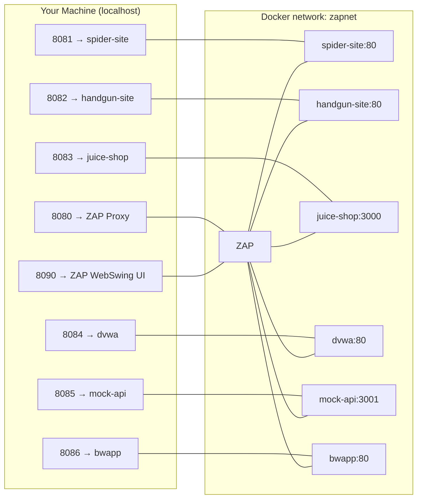

# Security Lab with ZAP, Nginx Test Sites, and Vulnerable Apps

## Overview
This project spins up a self-contained lab for experimenting with **web application security testing** using [OWASP ZAP](https://www.zaproxy.org/).
It launches multiple websites and APIs in Docker on a shared network (`zapnet`) so you can run **traditional/AJAX spiders** and **active scans**.

## Features
- **Spider Test Site** (`spider-site`)  
  Static HTML with deep links, hidden pages, `robots.txt`, `sitemap.xml`, a POST form, and a JS-generated link (styled with an ’80s “matrix” vibe).
- **Handgun Comparison Site** (`handgun-site`)  
  React + Nginx static build (tactical/military theme).
- **OWASP ZAP** (`zap`)  
  WebSwing UI + Proxy.
- **OWASP Juice Shop** (`juice-shop`)  
  Intentionally vulnerable Node app.
- **DVWA** (`dvwa`)  
  Classic intentionally vulnerable PHP app.
- **Mock JSON API** (`mock-api`)  
  JSON placeholder API backed by `api/db.json`.
- **bWAPP** (`bwapp`)  
  Intentionally vulnerable PHP/MySQL app with a huge catalog of security flaws.

## Project Structure

zap-testing-env
├── api
│   ├── db.json
│   └── Dockerfile
├── docker-compose.yml
├── handgun-site
│   ├── Dockerfile
│   ├── index.html
│   ├── nginx.default.conf
│   ├── package.json
│   └── src
│       ├── App.jsx
│       ├── main.jsx
│       └── styles.css
├── README.md
└── spider-test-site
    ├── about.html
    ├── assets
    │   └── script.js
    ├── blog
    │   ├── index.html
    │   ├── post1.html
    │   └── post2.html
    ├── contact.html
    ├── deep
    │   └── level1
    │       └── level2
    │           └── level3
    │               └── secret.html
    ├── hidden.html
    ├── index.html
    ├── login.html
    ├── robots.txt
    └── sitemap.xml

## Mermaid Architecture Diagram

Requirements
	•	Docker Desktop (or Docker Engine + Compose plugin)
	•	Allocate ~4–6 GB RAM in Docker settings (ZAP + Juice Shop + DVWA + bWAPP can be memory-hungry)

Usage

Start the stack

docker compose up --build

Access (from your host)
	•	Spider site → http://localhost:8081
	•	Handgun site → http://localhost:8082
	•	Juice Shop → http://localhost:8083
	•	DVWA → http://localhost:8084
	•	Mock API → http://localhost:8085
	•	bWAPP → http://localhost:8086
	•	ZAP WebSwing UI → http://localhost:8090/zap
	•	ZAP Proxy → http://localhost:8080

Access (from inside ZAP / same network)

Use service names (not localhost):
	•	http://spider-site/
	•	http://handgun-site/
	•	http://juice-shop:3000/
	•	http://dvwa/
	•	http://mock-api:3001/
	•	http://bwapp/

Example Workflows
	1.	Spidering & Crawling
	•	Run Traditional + AJAX spiders against http://spider-site/.
	•	Confirm JS-inserted links, deep paths, and disallowed robots.txt URLs are discovered.
	2.	Vulnerability Scans
	•	Active scan http://juice-shop:3000/, http://dvwa/, and http://bwapp/.
	•	Use the proxy to record traffic and re-scan.
	3.	API Testing
	•	Target http://mock-api:3001/products (extend api/db.json to add more endpoints).
	4.	Custom App Scan
	•	Scan http://handgun-site/ and compare results vs. the static spider site.

bWAPP Setup
	1.	Open http://localhost:8086/install.php.
	2.	Click the install link to set up the database.
	3.	Log in at http://localhost:8086/login.php with:
	•	Username: bee
	•	Password: bug

Tips
	•	In ZAP, right-click a site → Include in Context to constrain scope.
	•	DVWA often needs “Create/Reset Database” on first launch.
	•	bWAPP requires one-time database install (/install.php).
	•	For Juice Shop challenge guide: https://pwning.owasp-juice.shop/

Troubleshooting
	•	ZAP WebSwing/Xvfb issues: if WebSwing fails to start, try increasing Docker RAM and/or remove user: "zap" so it runs as root; add shm_size: "2gb" to the zap service if needed.
	•	Images fail to pull: use the Docker Hub images provided (no GHCR login needed).
	•	ZAP can’t reach sites: ensure you use service names (e.g., http://spider-site/) from inside ZAP.

Stop the stack

docker compose down --remove-orphans

License
	•	Spider and handgun test sites: MIT (this repository).
	•	ZAP, Juice Shop, DVWA, and bWAPP: their respective open-source licenses.
---
